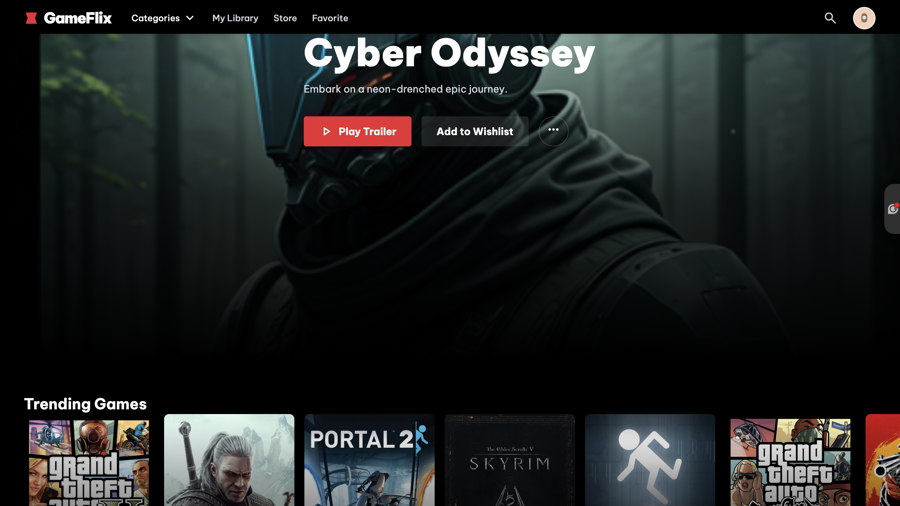
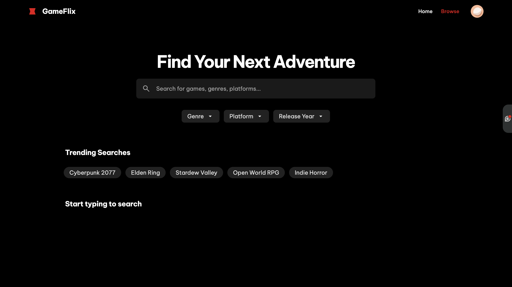

# GameFlix - Game Search & Recommendation Web App

GameFlix is a Flask-based web application that allows users to **search, browse, and discover video games** with detailed information including **cover images, genres, release dates, ratings, and summaries**. The app integrates with **IGDB (Internet Game Database)** via the Twitch API.

---

## Features

- **Search Games:** Real-time search suggestions with cover and genre information.
- **Game Details:** Click on a game to view detailed information, including release date, rating, summary, and cover image.
- **Trending Games:** Displays currently trending games based on popularity.
- **New Releases:** Shows the most recent game releases.
- **Recommended Games:** Returns curated game recommendations (default horror-themed, but extensible).
- **Responsive UI:** Built with **TailwindCSS**, fully responsive on desktop and mobile.

---

## Screenshots

  
  


> Make sure to replace the image URLs with your hosted images from your website.

---

## Tech Stack

- **Backend:** Python, Flask, Flask-CORS
- **Frontend:** HTML, TailwindCSS, JavaScript
- **APIs:** IGDB API via Twitch
- **Deployment:** Render / any cloud platform

---

## Setup & Installation

1. **Clone the repository:**

```bash
git clone https://github.com/yourusername/gameflix.git
cd gameflix
```
2. **Create a virtual environment:**
```bash
python -m venv venv
source venv/bin/activate  # Linux/Mac
venv\Scripts\activate     # Windows
```
3. **Install dependencies:**
```bash
pip install -r requirements.txt
```
## Set Twitch/IGDB credentials:
- Edit main.py (or app.py) and replace the placeholders with your Twitch Client ID and Client Secret.
CLIENT_ID = "YOUR_TWITCH_CLIENT_ID"
CLIENT_SECRET = "YOUR_TWITCH_CLIENT_SECRET"

##Run the app locally:
```bash
python main.py
```
##Deployment on Render
- Build Command:
  ```bash
  pip install -r requirements.txt
  ```
- Start Command:
  ```bash
  gunicorn main:app
  ```
